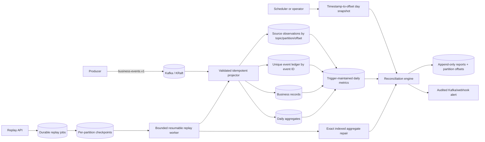

# Architecture



## Independent evidence model

A healthy date satisfies all of these relationships:

```text
Kafka offsets == source observations
source observations == unique event IDs
unique event IDs == business rows
business row count == aggregate count
business row amount == aggregate amount (within configured tolerance)
```

The first comparison detects missing consumption or unpersisted records. The second detects duplicate event IDs in distinct Kafka positions. The third detects projection loss or row deletion. The last two detect aggregate drift even when counts happen to match.

## Key decisions

1. Kafka counts come from offsets resolved at UTC broker-ingestion-day boundaries on a `LogAppendTime` source topic. Cost is proportional to partition count, not daily event volume.
2. `source_event_observations` is keyed by topic/partition/offset, while `business_event_ledger` is keyed by event ID. Keeping those identities separate makes duplicate source events observable instead of silently collapsing them.
3. PostgreSQL triggers maintain compact exact counts and database/aggregate amounts. Normal daily reconciliation reads one `daily_metrics` row.
4. Reports are append-only and include partition offset evidence, expected/actual values, signed delta, action, trigger, timestamp, and correlation ID.
5. Replay persists a stable per-partition source snapshot before processing. Checkpoints preserve next offset, counters, status, and heartbeat, allowing crash-safe resume without changing the original boundary.
6. Redis token locks coordinate schedulers and workers across replicas. PostgreSQL remains the durable source for reports, alerts, replay lifecycle, checkpoints, and sensitive mutation audit.
7. Replay jobs are inserted before Kafka command publication. The recovery scheduler redispatches missing commands and safely resets stale running jobs while enforcing a maximum attempt count.
8. Exact table scans are reserved for explicit replay/repair operations over bounded indexed dates, never the normal daily monitor.

## Time contract

Reconciliation dates are ingestion dates derived from the Kafka broker record timestamp in UTC. The source topic is created with `message.timestamp.type=LogAppendTime`, preventing producer clocks or late domain events from moving records across reconciliation boundaries. `BusinessEvent.eventTime` is preserved separately for domain reporting. External topic provisioning must retain this setting.

## Audit contract

- Event ledger, source observations, and reconciliation reports reject update/delete operations.
- Business rows reject updates; deletes are recorded in `data_mutation_audit` and alter the exact database metrics.
- Aggregate deletes and explicit repairs are audited; all aggregate changes are immediately reflected in compact metrics and reconciliation reports.
- Mutation-audit rows are append-only.
- Replay source bounds never change after checkpoint creation.


## Transactional alert outbox

Mismatch report persistence and creation of the configured `KAFKA`/`WEBHOOK` alert rows share one R2DBC transaction. Delivery state is durable (`PENDING`, `DELIVERED`, or `FAILED`) with an attempt counter and last error. Immediate delivery is an optimization; the recovery scheduler is the reliability mechanism. Delivery is at least once, so Kafka messages use the alert ID as key and webhooks receive a report-derived idempotency header.


## Replay execution fencing

The replay job `attempt_count` is also a fencing token. Every progress/heartbeat update requires `status = RUNNING` and the exact current attempt. The job row is fenced before a partition checkpoint is advanced, preventing a previously recovered worker from writing progress into a newer execution.
